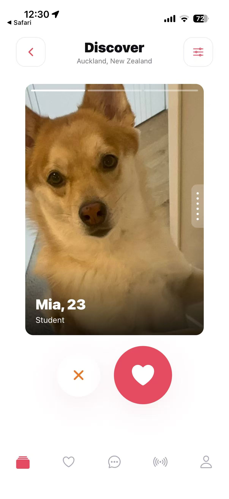
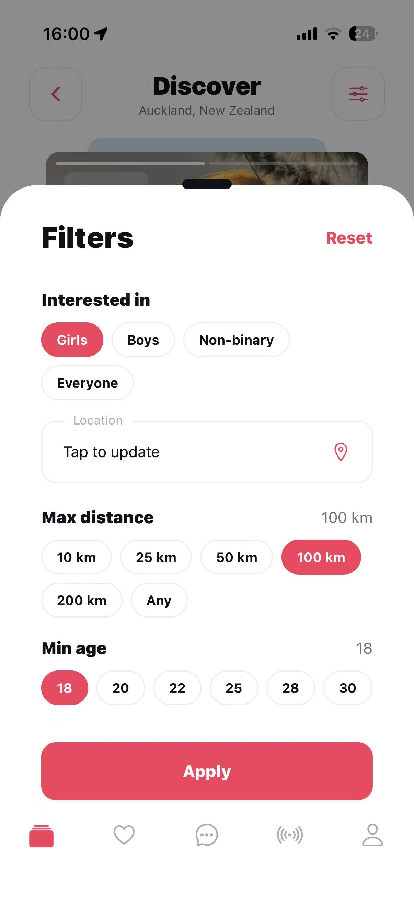
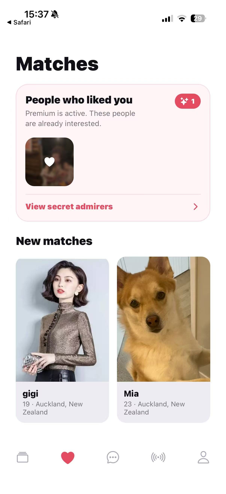
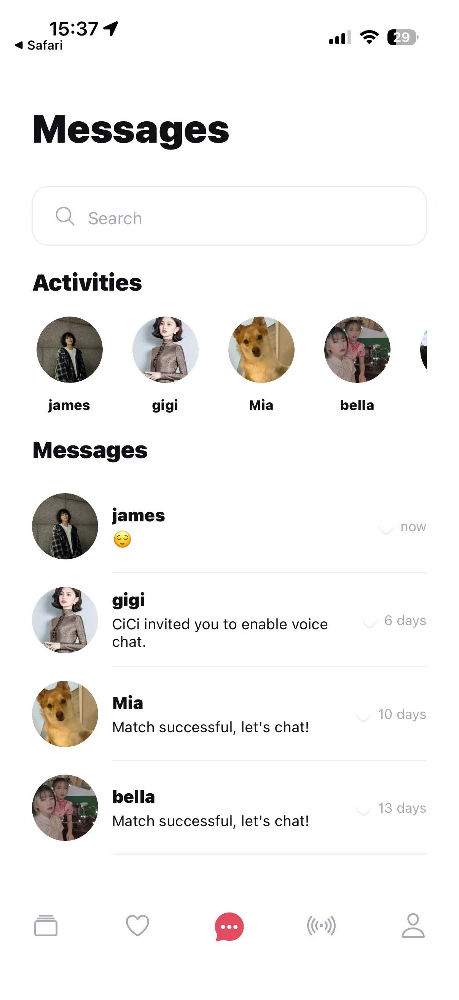
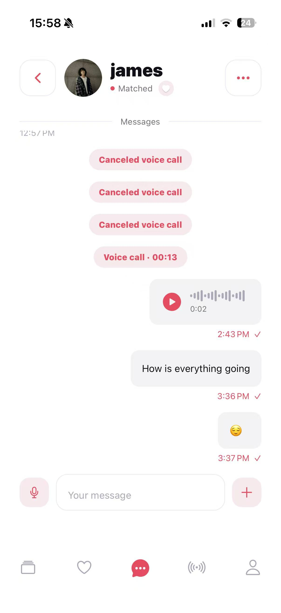
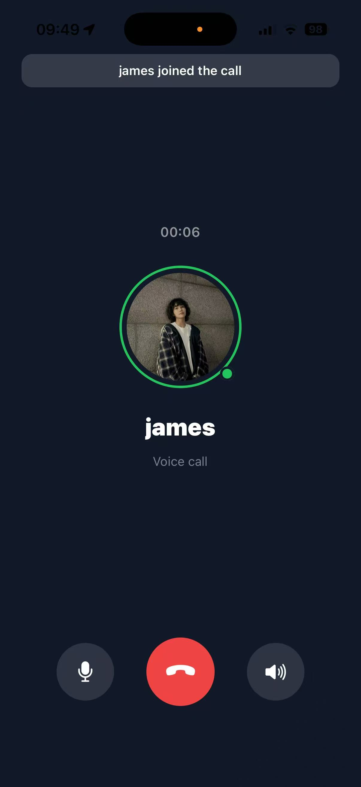
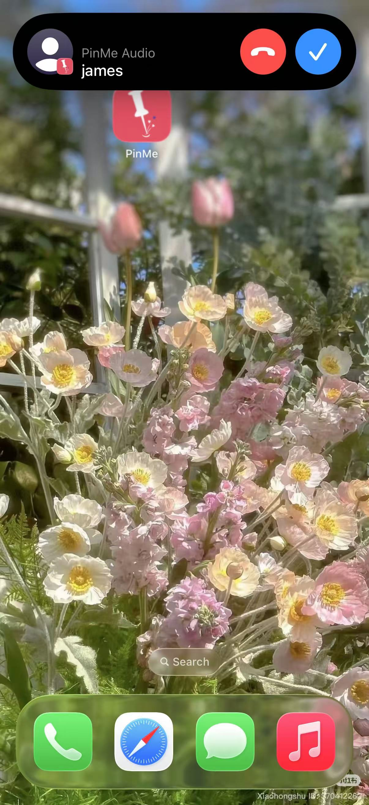
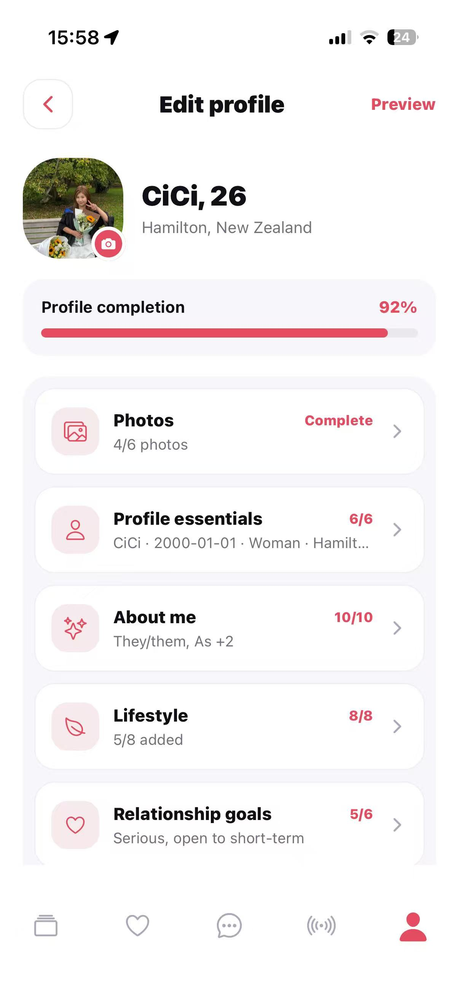

<p align="center">
  
</p>

<h1 align="center">PinMe</h1>
<p align="center"><em>Pin your heart. Meet your person.</em></p>

<p align="center">
  A location-based dating app with swipe matching, real-time chat, private voice calling,
  live voice rooms, and AI/vision-assisted safety features.
</p>

---

## Overview

PinMe is a full-stack dating app built as a monorepo: an Expo/React Native client and a
Node/Express API backed by PostgreSQL. It covers the full dating-app loop — discovery,
matching, and chat — plus capabilities most portfolio dating apps skip: **native 1:1
voice calling with CallKit/VoIP push, live group voice rooms, AWS Rekognition-assisted
photo moderation and face-presence checks, and AI-generated reply suggestions.**

## Team & Contributions

PinMe was built by a two-person development team. [Chengchen Xiong](https://github.com/Cicie44)
contributed across the mobile and backend codebases through **33 merged pull requests**, including:

- Authentication, navigation, onboarding, user profiles, and photo management
- Location-aware discovery, swipe matching, and cursor-based pagination
- Real-time text, image, video, and voice messaging
- Privacy controls, blocking, reporting, and account deletion
- LiveKit voice calls and native iOS CallKit/VoIP integration
- Mobile performance, reliability, and user experience improvements

[View Chengchen's merged pull requests](https://github.com/MiCiMiCi-Labs/pinme-dating-app/pulls?q=is%3Apr+is%3Amerged+author%3ACicie44)

## Screenshots

<table>
  <tr>
    <td></td>
    <td></td>
    <td></td>
    <td></td>
  </tr>
  <tr>
    <td></td>
    <td></td>
    <td></td>
    <td></td>
  </tr>
</table>

## Features

- **Discovery & matching** — swipe cards with distance/age/gender filters, mutual-match
  detection, and a "who liked you" queue.
- **Real-time chat** — text, images, GIFs, and voice messages, with typing/read state and
  reply-to threading.
- **AI reply assistant** — tone-selectable (warm / playful / curious) reply suggestions
  generated from conversation context via Groq's LLM API.
- **Private 1:1 voice calling** — LiveKit-powered calls with native iOS CallKit integration
  and VoIP push (APNs) so incoming calls ring like a real phone call, even from the
  background/killed state.
- **Voice rooms** — multi-participant live audio rooms (drop-in voice chat, not 1:1),
  with host controls and mic/speaker toggling.
- **Photo verification** — the first profile photo is checked with AWS Rekognition for content
  moderation and face presence before it is accepted.
- **Flexible auth** — Supabase-backed sign-in via Apple, Google, Facebook, or phone OTP.
- **Privacy controls** — block/report, discoverability toggle, and distance hiding.

## Tech Stack

**Mobile** — React Native (Expo SDK 54), Expo Router, TypeScript, React Query,
LiveKit React Native SDK, react-native-callkeep, and VoIP push for native calling.

**Backend** — Node.js, Express, TypeScript, Prisma ORM, PostgreSQL.

**Platform services** — Supabase (Auth, PostgreSQL hosting, Storage), LiveKit (voice
infrastructure), AWS Rekognition (photo moderation and face-presence checks), Groq (LLM reply
suggestions), Apple Push Notification service (VoIP and standard push).

## Monorepo Layout

```
apps/
  mobile/    Expo/React Native client
  backend/   Express API + Prisma schema
docs/        Feature specs and screenshots
```

## Getting Started

```bash
npm install
npm run db:generate

# Backend (requires apps/backend/.env — see apps/backend/.env.example)
npm run backend

# Mobile (requires a development client because the app uses native modules;
# it will not run in plain Expo Go)
npm run mobile
```

## Validation

```bash
# Backend tests
npm test --workspace=apps/backend

# Backend type-check/build
npm run build --workspace=apps/backend

# Mobile lint
npm run lint --workspace=apps/mobile
```
